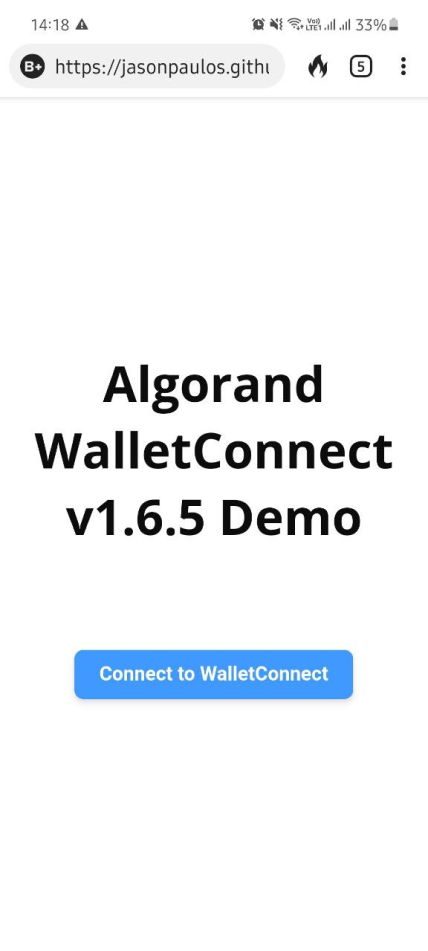
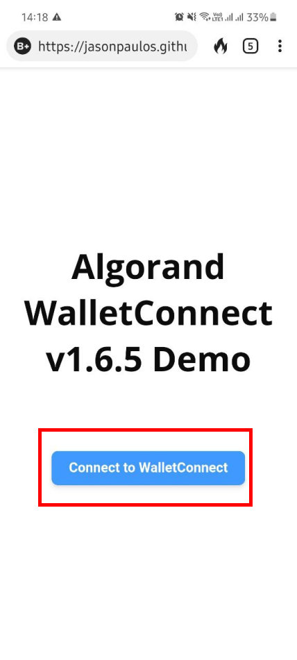
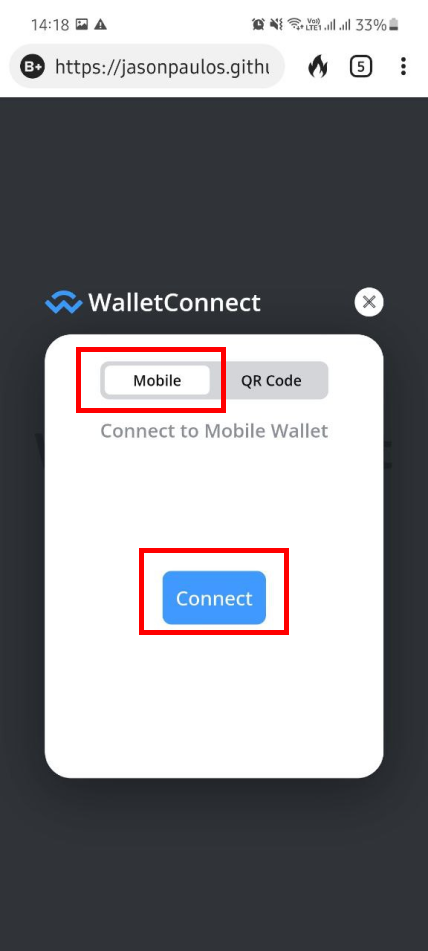
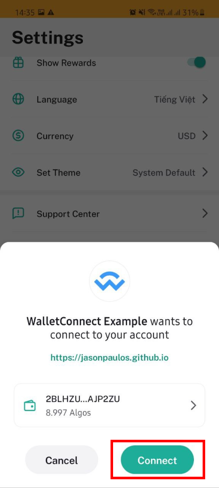
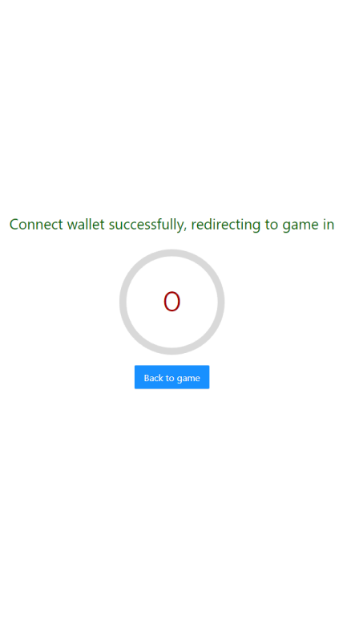

# Battle Bears NFT Game Sync
Battle Bears NFT Game Sync is a project that aims to provide playable NFTs based on the Algorand blockchain. Leveraging our newest Battle Bears game on iOS and Android. Players can purchase a Battle Bears NFT 3D skins on the popular AB2 Gallery, easily connect their Algorand Wallet in game, unlock their NFT skin in game and use it in real-time multiplayer matches. Then players can sell or transfer their Battle Bears NFT and the NFT Game Sync will update player's inventory in game. 

### iOS Demo Video https://youtu.be/ZOT0hrbhTj8

### Battle Bears NFT on AB2 Gallery  https://ab2.gallery/asset/453129670

### Android APK link available upon request

## Overview
This document contains 2 sections:
- [General flow](#GeneralFlow): Overview player's flow
- [User flow and details description](#Userflow): Going details each flow
    - [Step 1](#Step1): Players (already have NFT wallet) connect Wallet to Battle Bears Account.
    - [Step 2](#Step2): After connected Game get item list in players wallet.
    - [Step 3](#Step3): Game load Battle Bears items in Players NFT wallet in UI Battle Bears Inventory.
    - [Step 4](#Step4): Players use items in gameplay.

## General flow   
There are four general steps to load Items Battle Bears (Battle Bear) in the NFT wallet into Battle Bears game.
- Players (already have NFT wallet) connect Wallet to Battle Bears Account.
- After connected Game get item list in players wallet.
- Game load Battle Bears items in Players NFT wallet in UI Battle Bears Inventory.
- Players use items in gameplay.

## User flow and details description   

### Step 1: Player (already have NFT wallet) connect Wallet to Battle Bears Account   

Connect flow (Algo Wallet app only). Players need Algorand Wallet app ready on their mobile devices.

#### 1.1/ In the settings screen, players tab  `Connect NFT wallet`  button in game  
Players go to the setting menus, button locate at the top right in home screen. 

Then tab `Connect NFT wallet` button at the bottom right.

#### 1.2/ Game open WalletConnect (web page)  
After tapping the `Connect NFT wallet` button, Game going to open a web page called WalletConnect which helps players connect to Algorand NFT Wallet.

#### 1.3/ Player tab  `Connect to your Algorand Wallet`  button  

#### 1.4/ Player choose mobile method and tab  `Connect`  button
In mobile method, player tab Connect. This action will open Algorand Wallet app.

#### 1.5/ Player tab  `Connect`  button in the Algorand Wallet app
In Algorand Wallet app, players tab  `Connect` to allow connecting wallet to Battle Bears GameID.

#### 1.6/ Alogrand Wallet app  back to connnect gate (web page) automatically  
After confirmed, Algorand Wallet app reopen WalletConnect. The web page automatically back to Game after couple of seconds. 

#### 1.7/ Game display a connect successful pop-up

Done connect process. After connect successfully, button `Connect Algo wallet` turn to `Algo wallet + "wallet ID"`

If players want to disconnect Wallet from Battle Bears Account, they can tab button Wallet to disconnect.

### Step 2: After connected, game gets item list in players wallet 

After connected to the NFT wallet, Game update items in NFT Wallet into Battle Bears game. When new items added in players's inventory, red notification appears at the CLASSES icon.

### Step 3: Game loads Battle Bears items in Player NFT wallet in Game Inventory 

In game inventory, NFT items have specific icon profile picture with the Algorand icon.

### Step 4: Play with your NFT in real-time multiplayer battle 
Tap `PLAY` and join a real-time multiplayer battle with 5 other players and show off your new NFT.

## ROADMAP
The Battle Bears franchise has a wealth of nostalgic original art spanning 12 years that can be made into ASAs and NFTs for millions of fans. With NFT Game Sync we can make each Battle Bears NFT available in multiple Battle Bears games that span different genres from top-down brawlers, to tower defense to hard-core FPS. 

## TECHNOLOGY STACK
* Algorand
* Unity
* SkyFab (AWS) 
* Photon Bolt 
* Algorand Wallet
* MyAlgoWallet
* AB2.gallery

