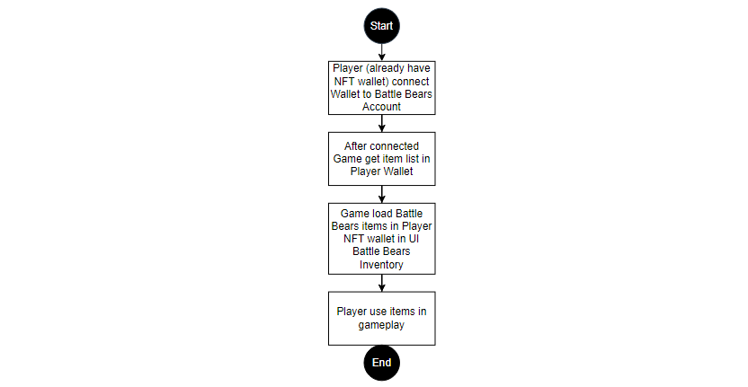
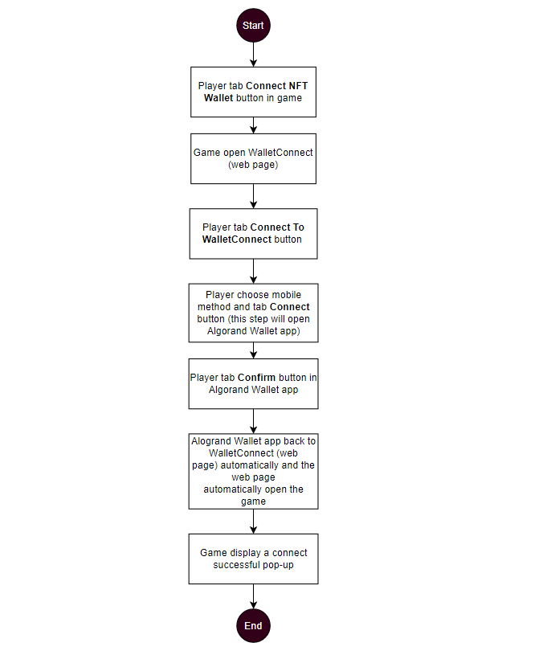
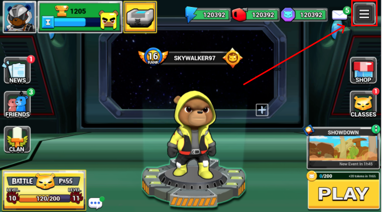
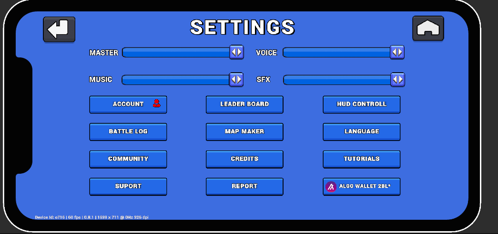
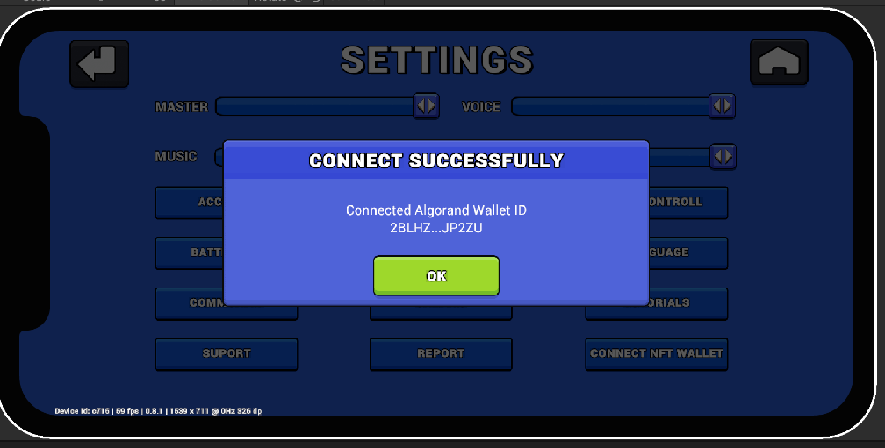
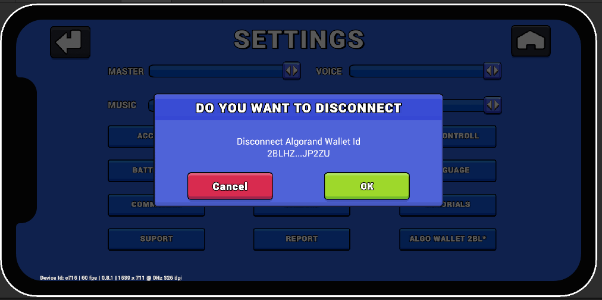
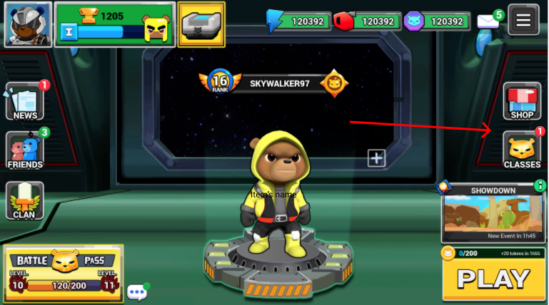

# Battle Bears NFT Game Sync
Battle Bears NFT Game Sync is a project that aims to provide easily playable 3D NFTs in real-time multiplayer games. For speed and real-world stress testing, we're using our latest Battle Bears mobile game with the Algorand Mainnet and the Algorand Wallet app. iOS and Android Players can purchase a Battle Bears 3D NFT on the popular AB2 Gallery, connect to their Algorand Wallet from our game, automatically unlock their NFT and use it in real-time multiplayer matches. Furthermore, players can sell or transfer their Battle Bears NFT and our NFT Game Sync will update the player's inventory in game.

### Android APK available in private repo and upon request.
### iOS Testflight builds available upon request. 

## Overview
This document contains 2 sections:
- [General flow](#GeneralFlow): Overview of the player's flow
- [User flow and details description](#Userflow): Goes into the details of each flow
    - [Step 1](#Step1): Player with an Algorand wallet can connect their Wallet to their Battle Bears Account.
    - [Step 2](#Step2): After connecting, the Game gets the item list in player's wallet.
    - [Step 3](#Step3): Game loads Battle Bears items in Players NFT wallet into player's game inventory.
    - [Step 4](#Step4): Success! Player uses items in gameplay.

## General Flow   
There are four general steps to load items in the Algorand Wallet then into the Battle Bears game.
- Player (already with an Algorand Wallet) connects their Wallet to their Battle Bears Account.
- After connecting, the game gets the item list from the player's wallet.
- Game load Battle Bears items from the player's wallet into their Battle Bears inventory.
- Player then use items in gameplay.

## User Flow   

### Step 1: Player (already have NFT wallet) connect Wallet to Battle Bears Account   

Connect flow (Algorand Wallet app only). Players need the Algorand Wallet app active on their mobile devices.

#### Step 1.1 In the Settings menu, players tap  `Connect NFT wallet`  button  
Player uses to the Setting menu button located at the top right in the home screen. 

Then tap `Connect NFT wallet` button at the bottom right.

#### Step 1.2 Game then opens WalletConnect via mobile browser  
After tapping the `Connect NFT wallet` button, the game opens a web page called WalletConnect which helps the player connect to their Algorand Wallet.

#### Step 1.3 Player taps  `Connect to your Algorand Wallet`  button  

#### Step 1.4 Player chooses mobile method and taps  `Connect`  button
In mobile method, player taps Connect. This action will open their Algorand Wallet app.

#### Step 1.5 Player taps  `Connect`  button in the Algorand Wallet app
In Algorand Wallet app, players tap  `Connect` to allow connecting wallet to Battle Bears game.

#### Step 1.6 Alogrand Wallet app sends player back game via to connnect gate automatically  
After confirming, Algorand Wallet app reopens WalletConnect. Player is sent back to the Game after 5 seconds. 

#### Step 1.7 Game displays a Connect Successful pop-up

Success! After connecting successfully, the button `Connect Algo wallet` turns into `Algo wallet + "wallet ID"` with the first three characters of players wallet to ensure player knows correct wallet is synced.

If players want to disconnect their Wallet from Battle Bears Account, they can tap button Wallet to disconnect.

### Step 2: After connected, game gets item list in players wallet 

After connected to the NFT wallet, Game update items in NFT Wallet into Battle Bears game. When new items added in players's inventory, red notification appears at the CLASSES icon.

### Step 3: Game loads Battle Bears NFT items in their Game Inventory 

In game inventory, NFT items have specific icon profile picture with the Algorand icon.

### Step 4: Play with your NFT in real-time multiplayer battle 
Tap `PLAY` and join a real-time multiplayer battle with 5 other players and show off your new NFT.

## ROADMAP
The Battle Bears franchise has a wealth of nostalgic original art spanning 12 years that can be made into ASAs and NFTs for millions of fans. With NFT Game Sync we can make each Battle Bears NFT available in multiple Battle Bears games that span different genres from top-down brawlers, to tower defense to hard-core FPS. We look forward to utilizing more Algorand technologies to foster more engagement and competition in our games. 

 

Battle Bears is a community driven franchise with thousands of contributions by fans of all ages and backgrounds. We are excited to integrate Algorand Smart Contracts for community submitted content and influencer time contributions to allow them to participate in the growth of the game franchise. With Algorand, we can accelerate the Create-to-Earn and Play-to-Earn movements with our games.  

## TECHNOLOGY STACK
* Algorand
* Unity
* SkyFab (AWS) 
* Photon Bolt 
* Algorand Wallet
* MyAlgoWallet
* AB2.gallery

## ABOUT BATTLE BEARS
The Battle Bears franchise is created and owned 100% by SkyVu and has amassed over 40 Million downloads across iOS, Android, and PC. Battle Bears has reached the top game charts around the world and has won several Mobile Game of the Year awards. SkyVu games have been featured by Apple, Google, Amazon and Microsoft.

Battle Bears Facebook (96k) https://facebook.com/BattleBears

Battle Bears YouTube (42k) https://youtube.com/BattleBears

Battle Bears Twitter https://twitter.com/BattleBears
